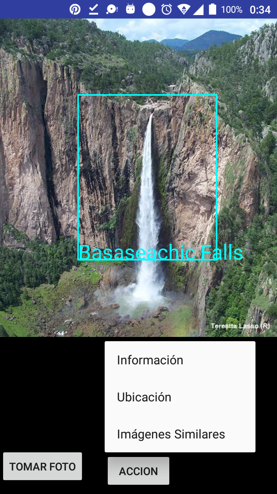

# Search By Image 
The idea of the project is find information about important landmarks around the world just by taking a photo of them.
This application uses the Google Cloud Vision API for this task.

Result
-----------

